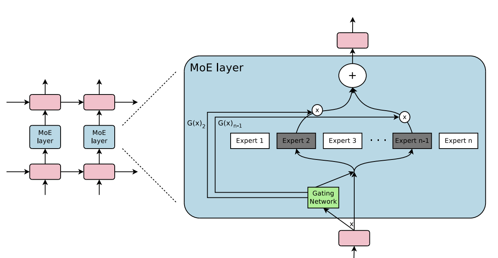
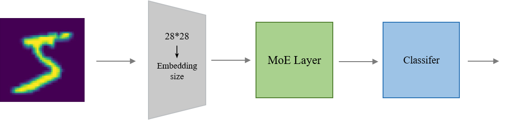

# Mixture of Experts(MoE)

## 1.MoE Layer结构



对于待计算的输入向量`embedding`，

- 准备n个`expert`子网络
- 准备`gateway linear`层，输入`embedding`可以输出n个概率值
- 选择`n`个概率中最高的`top`个位置，作为被选中的`expert`子网络
- `embedding`分别被top个`expert`子网络运算，输出的`embedding`分别与各自的概率值相乘，并`pointwise`相加，得到最终的输出向量`embedding`

此外，需要考虑`expert`之间的均衡性，避免网络倾向于某几个`expert`。

- 训练阶段，`gate`的概率输出需要加上噪音，以便能有概率跳出`expert`倾向
- 训练阶段，需要补充1个额外的`loss`，目的是让各`expert`的总概率打分趋于一致，避免有`expert`倾向

这两个特性在推理阶段都会关闭。

## 2.MNIST-MoE

基于MoE架构的MNIST分类模型

将输入的手写数字图片拉平成`28*28`的向量，再将向量通过线性层转`embedding size`，再将向量输入到`MoE Layer`中(`MoE Layer`的配置为`EXPERTS=8`,`TOP=2`)



### 训练

```
python train.py
```

## Reference

[OUTRAGEOUSLY LARGE NEURAL NETWORKS: THE SPARSELY-GATED MIXTURE-OF-EXPERTS LAYER](https://arxiv.org/pdf/1701.06538)

[mnist-onnx-runtime](https://github.com/owenliang/mnist-onnx-runtime)
